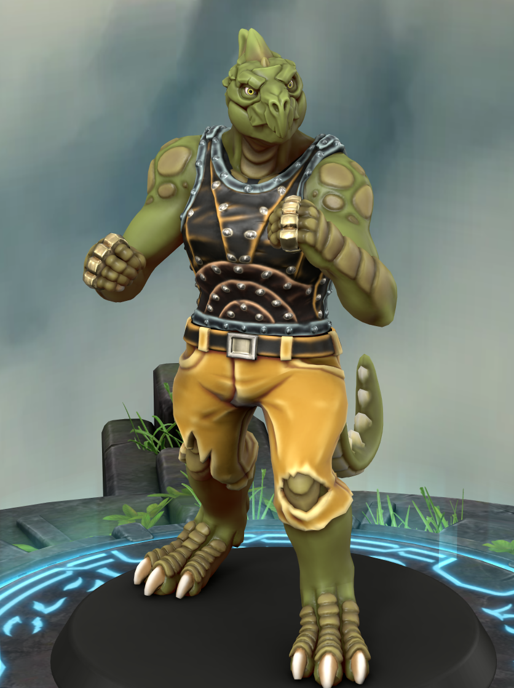

# Kathassisk "Scab" Sethkash

## Description

A tall broad-shouldered Lizardfolk with dull brownish-green scales, crossed with pale scars: knuckle splits, a faded bite-mark on the left forearm, a patch of rougher scale along the jaw where something didn't heal right. The brass knuckles on his hands catch the light when he moves; when he doesn't move you might not notice him at all. He speaks little and smiles less. When he does talk, it's in low, clipped Maritime Common, the sibilants and clicks of his native Lizardfolk still bleeding through despite years on the docks. He has the stillness of someone who sees everything — and the eyesight of someone who doesn't. Beneath the stillness, though, there's a tension in his shoulders that hasn't unclenched in years.

## Background

Kathassisk was hatched in the marshes of Ixuen. His people raised their young in communal lodges — eggs brooded in warm mud-brick hatcheries, hatchlings raised by elders whose sole duty was the keeping of children. A mother or father, in the human sense, isn't a concept Kathassisk would recognise; the lodge was simply the lodge. When he came of age, he faced the proving trials that every Ixuen youth must pass — swimming, boatcraft, and combat — to earn a place in the community. He was strong, but unlucky. A river-crocodile took an interest in his swimming trial, and though he survived, he placed last. His assignment was labourer, not hunter or shipwright. When a merchant crew arrived that season to trade for marsh-iron, mangrove timber, and the pressed bog-myrtle oil that Ixuen still-houses sold to foreign perfumers, his lodge elders offered him as deck labour in the bargain — a hard trade, but one that bought the community a winter's worth of worked cloth and good steel.

He worked the trade routes north until the ship put in at a Knuckles port and he walked. A Lizardfolk with no clan and no coin doesn't get honest work on the docks. So he undercut the dock gangs, took the jobs they refused ... and took the jobs they wanted. He took their beatings, too, until he learned to give them back.

They call him "Scab" for it, and he has let the name stick. It is simpler than his birth name here; he has been gone too long to be Kathassisk, and no one in the Knuckles can pronounce it right anyway.

He left nothing behind but his people, and he has no way of knowing whether they still live; the marshes of Ixuen are a long way south, and Lizardfolk communities don't send letters. He's never felt the urge to find out. The lodge raised him, but it didn't love him, and the distinction matters less to him than it might to a human.

He has now survived a few years that way: dockside fights, odd jobs, the occasional stint as hired muscle on a coastal trader. He finds that fists settle arguments faster than words, and that brass knuckles settle them faster than fists — but a belaying pin or a broken bottle will do in a pinch. When his work brings him to Noamin, the regulars at the Fox and Falcon know him by now: a lizard who doesn't start trouble but often seems to be where it ends.

He doesn't think in terms of what he wants — he thinks in terms of what he won't let happen again. Sold once as a juvenile, he has spent every year since making sure no one else gets to decide where he sleeps or what he carries. Beyond that, he doesn't plan. The docks taught him that plans are for people with money, and he's never had enough of either to make it a habit.

## Traits & Personality

- **Chaotic Neutral.** Doesn't start fights, but finishes them. Lives by a personal code that doesn't map cleanly onto good or evil. Territorial, direct, transactional. Respect is earned by competence, not titles. A fast-talker with no follow-through earns contempt; a quiet sailor who knows their knots earns an unspoken alliance.
- **The brass knuckles.** Always on him.  They sometimes cause problems, but also help solve them.
- **Can't read.** He has never learned, doesn't care, and gets irritable when someone waves a map or document in his direction.
- **Cannibalism.** In his home culture, eating the dead is expected: waste nothing, honour the fallen by taking their strength. He's been on human docks long enough to know they find it abhorrent, but the taboo still registers as faintly ridiculous to him. He doesn't flaunt it, doesn't hide it, just genuinely doesn't understand why you'd bury good meat.
- **Knows people in ports.** Not friends. A fence here, a tavernkeep he brawled with and bought a round for after, a ship's carpenter who once splinted his hand. Transactions, all of them.

